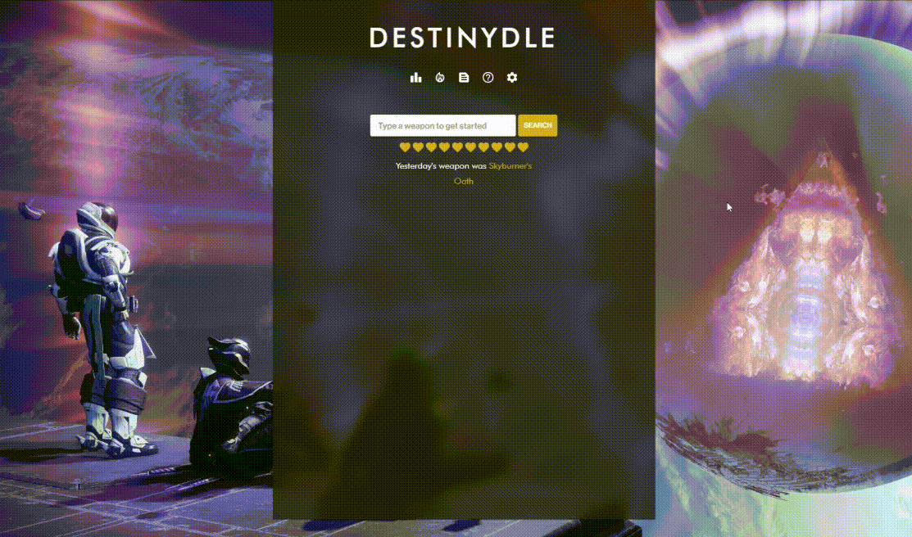

# Destinydle

**A daily exotic weapon guessing game for Destiny 2 fans. Inspired by Wordle, built with React, Node.js, and MongoDB.**

## 🌟 Overview

Destinydle challenges players to guess a random Destiny 2 exotic weapon each day. Using hints and feedback after each guess, players have limited attempts to identify the weapon of the day.

## 🚀 Tech Stack

- **Frontend**: React
- **Backend**: Node.js
- **Database**: MongoDB

## 🕹️ Features

- New exotic weapon each day
- Hints and validation for each guess
- Clean, responsive interface
- Backend API to fetch and validate guesses
- MongoDB stores weapon data and user history
