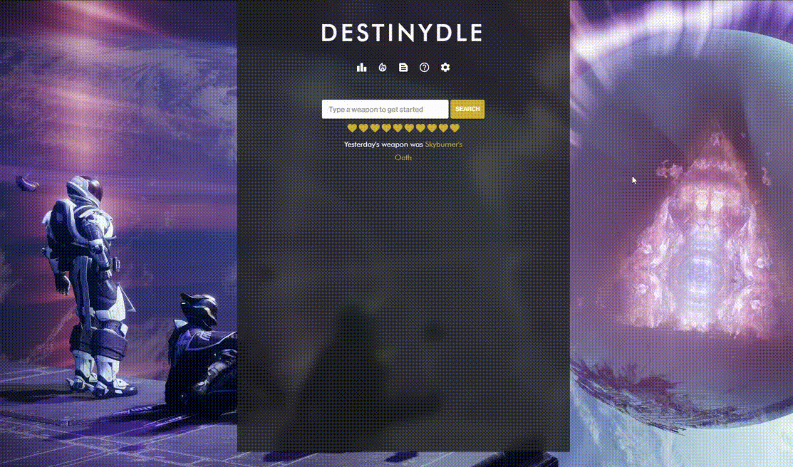

# Destinydle

**Destinydle is a daily guessing game for Destiny 2 exotic weapons, inspired by Wordle. Built with React and Node.js.**

## Overview

Destinydle challenges players to guess a random Destiny 2 exotic weapon each day. Using hints and feedback after each guess, players have limited attempts to identify the weapon of the day.

## Tech Stack

- **Frontend**: React
- **Backend**: Node.js
- **Database**: MongoDB

## Features

- New exotic weapon each day
- Hints and validation for each guess
- Clean, responsive interface
- Backend API to fetch and validate guesses
- MongoDB stores weapon data and user history

## Notes

- I pulled from the destiny2 api to populate the db in the future would be better to use the api directly
- No stats or anything **Yet**
- More features coming soon!

## Update #1

Big Updates here. I spent time creating scripts to scrape the bungie API to populate a local JSON file instead of relying on manual entries that I put into mongoDB myself I did this primarilly because mongoDB dropped my hard work **sigh**. but this version is much better I feel

I don't think I will continue to update this project as it is pretty much feature complete besides stats and being able to actually log in.
